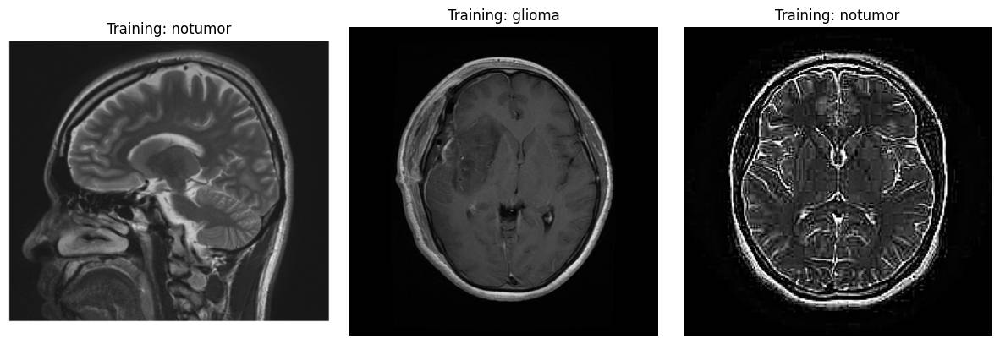
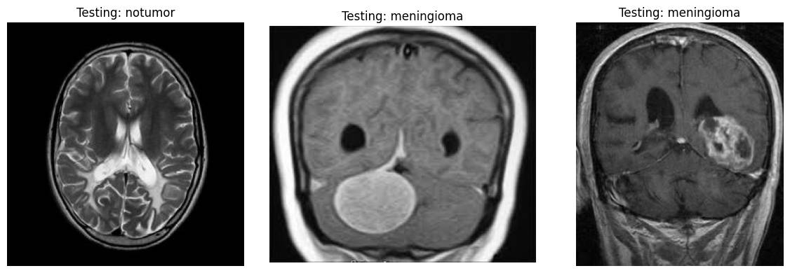
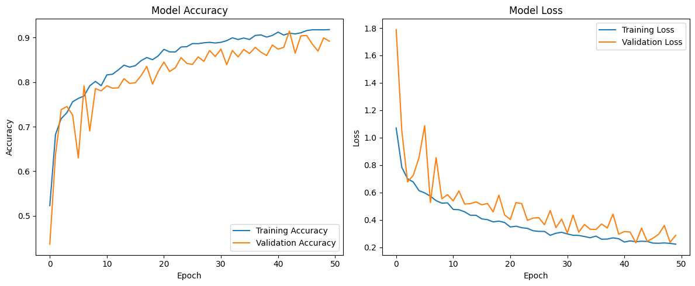
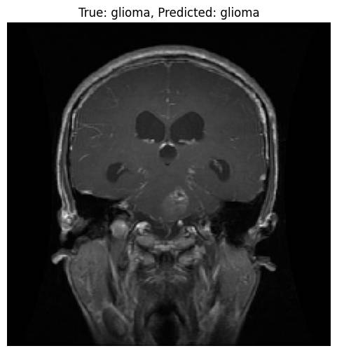
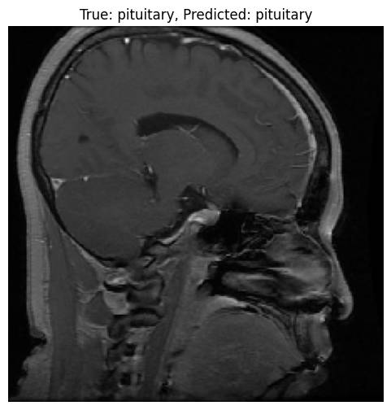
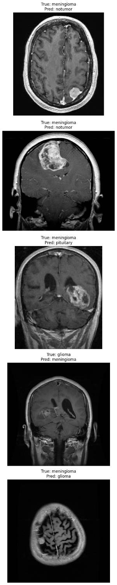
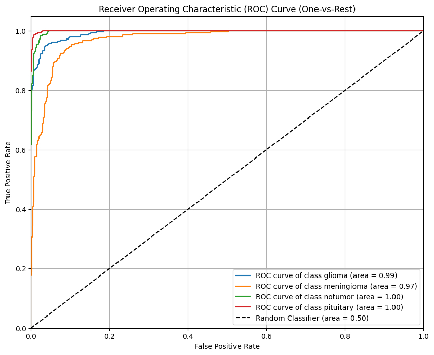
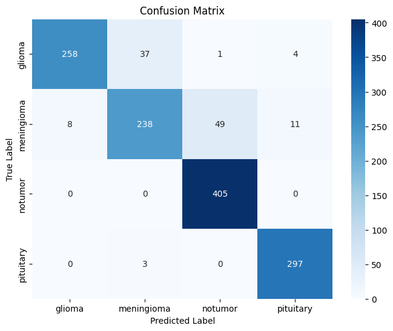
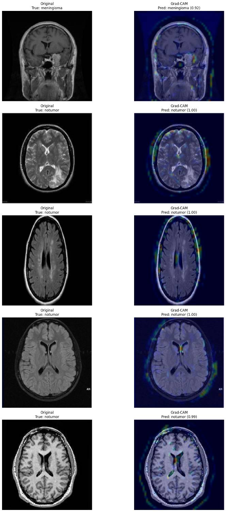
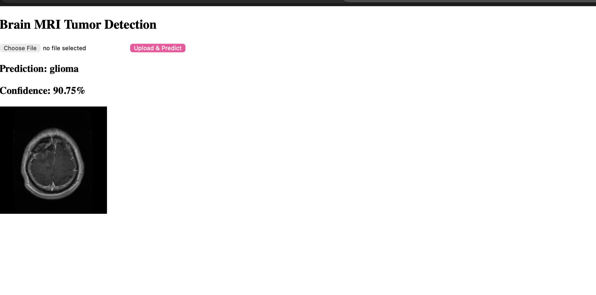

# Brain Tumor MRI Classification using CNN

A deep learning project for multi-class brain tumor classification using MRI scans and Convolutional Neural Networks (CNNs).

The model classifies MRI images into four categories:

- Glioma
- Meningioma
- Pituitary Tumor
- No Tumor

The project includes:

- dataset preparation
- image preprocessing and augmentation
- CNN model training
- model evaluation
- prediction pipeline
- ROC/AUC analysis
- confusion matrix visualization
- Grad-CAM explainability visualizations

---

## Dataset

Dataset source:

- Brain Tumor MRI Dataset by Masoud Nickparvar

Dataset link:

https://www.kaggle.com/datasets/masoudnickparvar/brain-tumor-mri-dataset

The dataset contains MRI images for:

- glioma
- meningioma
- pituitary tumor
- no tumor

---

## Dataset Samples

Add MRI sample images here.

---

## Features

- MRI image preprocessing
- Data augmentation
- CNN-based image classification
- Early stopping and checkpointing
- Accuracy and loss visualization
- ROC/AUC analysis
- Confusion matrix generation
- Prediction visualization
- Incorrect prediction analysis
- Grad-CAM explainability
- Flask web application

---

## Model Architecture

The project uses a custom CNN architecture with:

- convolutional layers
- max pooling layers
- dropout regularization
- dense classification layers

The final layer uses softmax activation for multi-class classification.

---

## Training and Validation Curves

Add training accuracy and loss plots here.

---

## Prediction Examples

Add prediction output examples here.

---

## Incorrect Predictions Analysis

Add examples of misclassified MRI images here.

---

## ROC/AUC Curve

Add ROC/AUC visualization here.

---

## Confusion Matrix

Add confusion matrix visualization here.

---

## Grad-CAM Visualization

Grad-CAM is used to highlight image regions influencing the model’s predictions.

Add Grad-CAM output images here.

---

## Flask Web Application

The web app includes these elements:

- image upload interface
- prediction display
- confidence scores

---

## File Descriptions

### "dataset_loader.py"

Responsible for:

- downloading dataset using Kaggle API
- extracting dataset
- image preprocessing
- dataset visualization
- training/testing generators

---

### "model_builder.py"

Responsible for:

- CNN architecture definition
- model compilation
- callbacks
- model training

---

### "evaluate.py"

Responsible for:

- training and validation metrics
- evaluation plots
- ROC/AUC analysis
- model performance analysis

---

### "predict.py"

Responsible for:

- loading trained model
- random image prediction
- prediction probability analysis
- incorrect prediction visualization

---

### "gradcam.py"

Responsible for:

- confusion matrix generation
- classification report
- Grad-CAM heatmap visualization
- explainability analysis

---

## Installation

Clone the repository:

git clone https://github.com/YOUR_USERNAME/YOUR_REPOSITORY.git

Install dependencies:

pip install -r requirements.txt

---

## Requirements

Main libraries used in this project:

tensorflow
numpy
matplotlib
opencv-python
scikit-learn
seaborn
pillow
kaggle

---

## Kaggle API Setup

Download your "kaggle.json" API token from Kaggle account settings and place it in:

~/.kaggle/kaggle.json

For Google Colab:

from google.colab import files
files.upload()

---

## Future Improvements

Possible future improvements:

- transfer learning architectures
- MobileNetV2 or EfficientNet integration
- Deploy and develop streamlit interface 
- improved explainability methods
- hyperparameter optimization

---

## License

This project is licensed under the MIT License.

See the "LICENSE" file for details.
